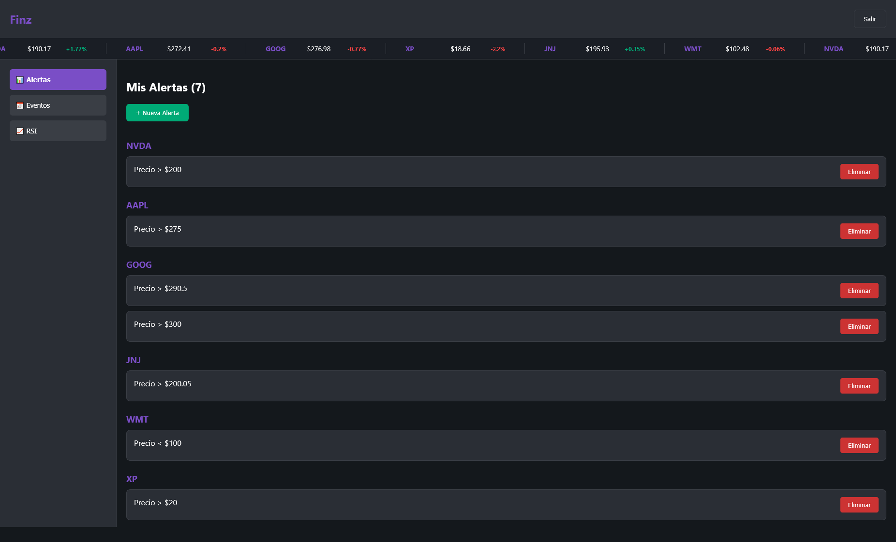
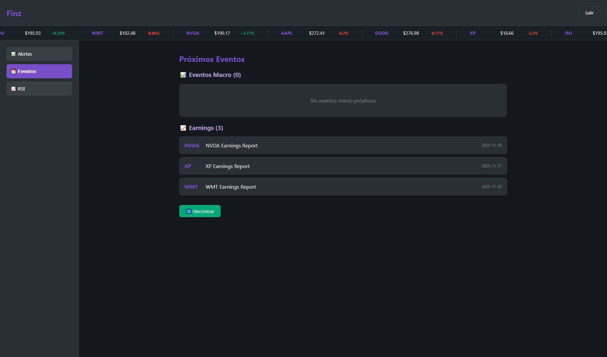
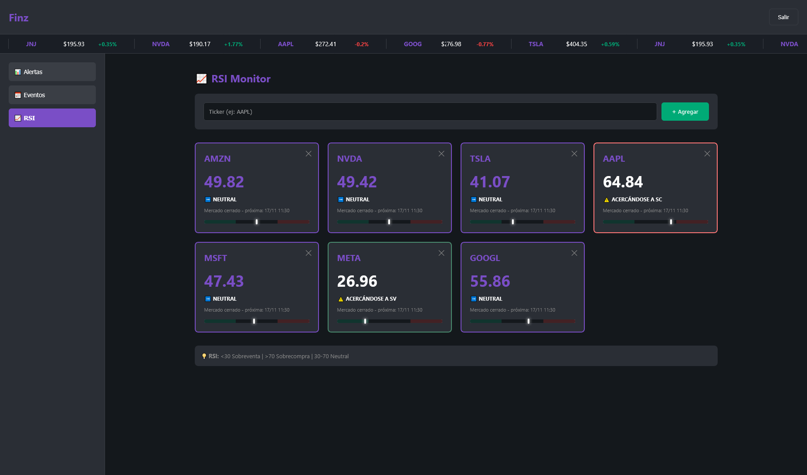

# 💻 Finz - Financial Monitoring Platform (Frontend)

Dashboard interactivo para monitoreo de acciones en tiempo real con alertas y análisis técnico.


## 🚀 Características

- ✅ **Dashboard interactivo** con ticker tape en tiempo real
- ✅ **Gestión completa de alertas** (crear, ver, eliminar)
- ✅ **Monitor de RSI** con señales visuales
- ✅ **Calendario de eventos** económicos y earnings
- ✅ **Notificaciones push** en navegador
- ✅ **Autenticación segura** con refresh tokens automático
- ✅ **Diseño responsive** (mobile-first)

## 🛠️ Stack Tecnológico

- React 18
- TypeScript
- React Router DOM (navegación)
- Axios (HTTP client)
- Web Push API (notificaciones)
- CSS Modules (estilos)

## 📁 Arquitectura del Proyecto

```
finz-frontend/
├── public/
│   ├── service-worker.js    # Service Worker para push notifications
│   └── manifest.json
├── src/
│   ├── components/          # Componentes reutilizables
│   │   ├── Navbar.tsx
│   │   ├── Sidebar.tsx
│   │   └── TickerTape.tsx
│   ├── pages/               # Páginas principales
│   │   ├── Login.tsx
│   │   ├── MainLayout.tsx
│   │   ├── CrearAlerta.tsx
│   │   └── Dashboard/
│   │       ├── Alertas.tsx
│   │       ├── Eventos.tsx
│   │       └── RSI.tsx
│   ├── services/
│   │   └── api.ts          # Cliente Axios + endpoints
│   ├── hooks/
│   │   └── useAuthRefresh.ts
│   ├── utils/
│   │   └── notifications.ts
│   └── App.tsx
```

## 📱 Funcionalidades

### 🔐 Autenticación

- Login con correo y contraseña
- Tokens JWT (access + refresh)
- Renovación automática de tokens cada 25 minutos

### 📊 Dashboard

- **Ticker Tape:** Scroll infinito con precios en tiempo real
- **Indicadores de cambio:** Colores y animaciones para subidas/bajadas
- **Actualización automática** cada 30 segundos

### 🔔 Sistema de Alertas

- Crear alertas de precio (mayor/menor que X)
- Ver todas las alertas agrupadas por ticker
- Alertas activadas destacadas en verde
- Eliminar alertas con confirmación
- Notificaciones push cuando se activan

### 📈 Monitor de RSI

- Agregar tickers a seguimiento
- **Visualización con colores:**
  - 🟢 Verde: Sobreventa (RSI < 30)
  - 🔴 Rojo: Sobrecompra (RSI > 70)
  - 🟣 Morado: Neutral (30-70)
- Barra de progreso visual del RSI
- Próxima actualización visible

### 📅 Eventos Económicos

- **Eventos macro:** FED, datos económicos USA
- **Eventos micro:** Earnings de tus tickers
- **Próximos 7 días** calendario

## 👤 Autor

**Germán Sosa**

- LinkedIn: [linkedin.com/in/germán-sosa](https://www.linkedin.com/in/germán-sosa)
- GitHub: [@Gersosa-18](https://github.com/Gersosa-18)

## 🔗 Links Relacionados

- [Backend (FastAPI + PostgreSQL)](https://github.com/Gersosa-18/finz)
- [🔗 Demo en vivo](https://finz-frontend.vercel.app)

## 📸 Screenshots


_Dashboard con ticker tape y precios en tiempo real_


_Calendario de eventos económicos y earnings_


_Monitor de RSI con señales visuales_
